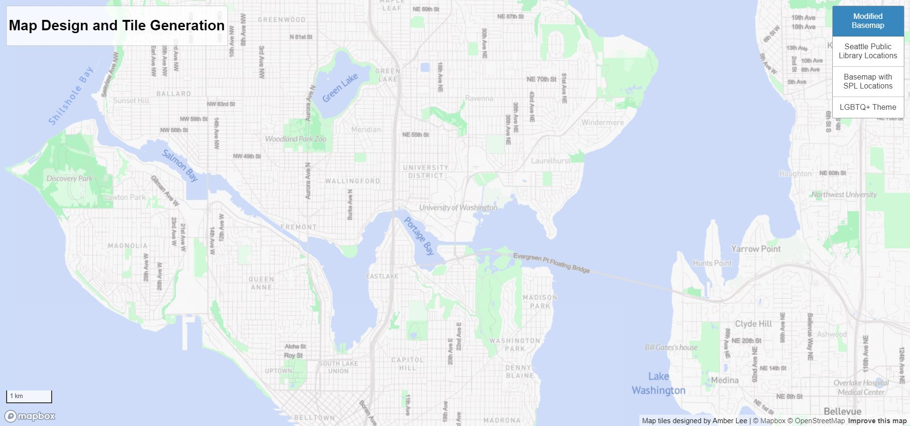
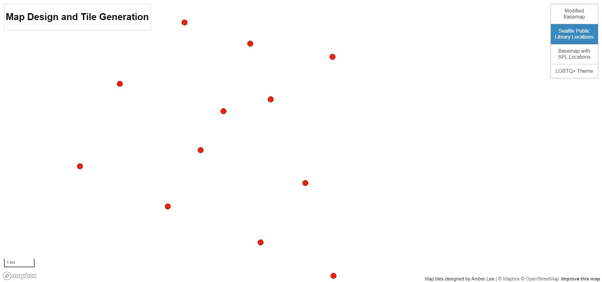
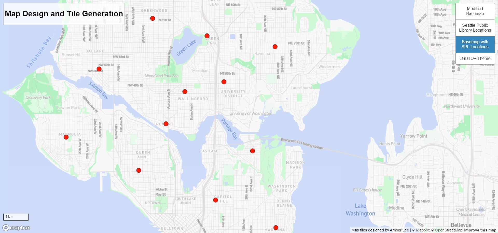
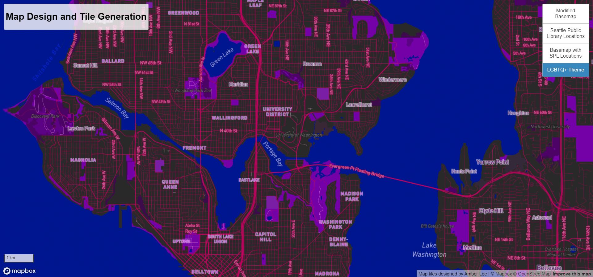

# Map Design and Tile Generation
For this project, I created four map layers of Seattle and some of its surrounding areas. Each layer is available at the zoom levels 10 to 14. Click [here](https://amberl8.github.io/map-tiles/index.html) to access the web application.

### Layer 1: Modified Basemap
This layer started as the light monochrome basemap provided by Mapbox, but I then edited the the color palette as well as fonts of the basemap to create my own unique layer.

### Layer 2: Seattle Public Library Locations
The second layer contains points representing the locations of all branches of the Seattle Public Libraries.

### Layer 3: Combined Basemap and Library Locations
The third layer contains my modified basemap as well as the Seattle Public Library locations.

### Layer 4: LGBTQ Theme
This layer started as the dark monochrome basemap provided by Mapbox, but I then edited the color palette to embody LGBTQ+ pride, particularly to match the bisexual flag.

